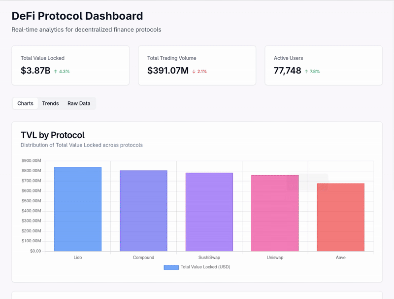

# DeFi Dashboard (chaos<3)

simple dashboard for visualizing DeFi protocol metrics including total value locked (TVL), trading volume, and user statistics across different blockchains and protocols.



## Features

- visualize TVL by protocol and volume by blockchain
- responsive design desktop and mobile devices
- switch between charts, trends, and raw data views
- built with shadcn UI components clean and modern
- display current metrics from a SQLite database

## Technology Stack

- next.js 
- tailwind CSS, shadcn
- chart.js, react-chartjs-2
- sqlite with better-sqlite3
- docker

## Local Setup

### Step 1: requirements

Install SQLite:
```bash
sudo dnf install sqlite   # Fedora/RHEL
# OR
brew install sqlite       # macOS
# OR
sudo apt install sqlite3  # Debian/Ubuntu
```

### Step 2: dependencies

`npm install`


### Step 3: generate sample data

`npm run sql:setup`

### Step 4: start dev server

`npm run dev`

## Docker Setup

### Using Docker Compose (Recommended)

`docker-compose up --build`

## directory structure

- `/src/app`: main directory
  - `/api`: API routes for fetching metrics data
  - `/page.tsx`: main dashboard view with charts
- `/src/components`: reusable UI components
  - `/ui`: shadcn UI components (cards, etc.)
- `/src/lib`: utility funcs and db connection
- `/scripts`: db init and data generation scripts

## Dev Notes

### UI Components

The dashboard utilizes shadcn UI inspired components for a consistent and professional look:

- cards.tsx: For containing chart sections and data views
#### TODO: outside the scope of this project
- tabs.tsx: For tabbed navigation
- Custom Buttons: For interactive elements

### Data Viz

Chart.js is used with the following chart types:

- bar chart: for protocol TVL comparison
- doughnut chart: For volume distribution by blockchain
- line chart: for trend analysis over time

### DB

The application uses SQLite for storing metrics data. Its easy simple to use and very flexable. Great for the small sample dataset. The database is initialized with sample data during setup.

## Deployment

The application can be deployed using docker/podman with the included Dockerfile and docker-compose.yml. The update.sh script provides an automated way to pull latest changes and redeploy.

## Completed Tasks

- DONE: implementation shadcn components
- DONE: responsive layout
- DONE: graphs and data agregation
- DONE: try your best to be type-safe
- DONE: docker setup

## Future Enhancements

- authentication system for admin access
- integration with live deFi data APIs
- improve filtering and sorting options
- historical data analysis
- improve performance for example large datasets
- integration with tanstack query for data fetching
